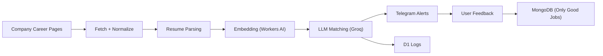

# Sibyl - AI Internship Scout

Sibyl is an autonomous, explainable internship discovery system. It fetches internships from company career pages, matches them to a candidate profile, and delivers ranked results via Telegram. Every decision is logged for transparency, debugging, and analytics.

This repo contains:
1. A FastAPI backend that fetches, normalizes, embeds, and matches internships.
2. A Telegram bot that delivers results and captures feedback.
3. Cloudflare D1 logging for auditability and traceability.

---

# What Sibyl Does

Sibyl:
- Scans company career pages for internships.
- Filters to software, web, full-stack, and frontend roles.
- Parses a resume into a structured profile.
- Embeds jobs and profile for similarity scoring.
- Uses an LLM to explain match quality and uncertainty.
- Sends results to Telegram with feedback buttons.
- Logs every job and system event to Cloudflare D1.
- Stores only user-approved jobs in MongoDB.

---

# System Overview



---

# Project Structure

```
sibyl/
  ai-service/
    main.py
    db.py
    resume_parser.py
    job_matcher.py
    job_fetcher.py
    job_fetchers/
      ashby.py
      greenhouse.py
    prompts/
  telegram-bot/
    bot.py
  requirements.txt
  companies.txt
  README.md
```

---

# Environment Variables

Create a `.env` file in the repo root with:

```
BOT_TOKEN=
CLOUDFLARE_ACCOUNT_ID=
CLOUDFLARE_API_TOKEN=
CLOUDFLARE_DATABASE_ID=
MONGODB_URI=
GROQ_API_KEY=
```

Descriptions:
- `BOT_TOKEN`: Telegram Bot token from BotFather.
- `CLOUDFLARE_ACCOUNT_ID`: Cloudflare account ID (for Workers AI and D1).
- `CLOUDFLARE_DATABASE_ID`: D1 database ID.
- `CLOUDFLARE_API_TOKEN`: Cloudflare API token with D1 + Workers AI permissions.
- `MONGODB_URI`: MongoDB connection string (used for resumes + saved jobs).
- `GROQ_API_KEY`: Groq API key for Llama 3.3 70B matching.

---

# Required API Tokens

Cloudflare API token (single token for both D1 and Workers AI):
- Account -> D1 -> Edit
- Account -> Workers AI -> Edit

Groq API key:
- Create a key in the Groq console and place it in `GROQ_API_KEY`.

Telegram bot token:
- Create a bot with BotFather and place it in `BOT_TOKEN`.

---

# D1 Logging

Make sure these tables already exist in your D1 database:
- `job_logs`
- `event_logs`

What is logged:
- Each job (with normalized metadata and match score).
- System events (fetch complete/fail, match complete, system errors).

---

# D1 Schemas

`job_logs`

```
id INTEGER PRIMARY KEY
job_id TEXT NOT NULL
company TEXT NOT NULL
source TEXT NOT NULL
title TEXT
location TEXT
is_remote BOOLEAN
employment_type TEXT
score REAL
decision TEXT
matched_skills TEXT
missing_skills TEXT
uncertainty TEXT
user_feedback TEXT
apply_url TEXT
job_url TEXT
first_seen_at DATETIME
last_seen_at DATETIME
```

`event_logs`

```
id INTEGER PRIMARY KEY
event_type TEXT
source TEXT
company TEXT
status TEXT
message TEXT
created_at DATETIME
```

---

# MongoDB Usage

MongoDB stores:
- Parsed resumes.
- Only jobs explicitly marked as "good" by the user in Telegram.

All other jobs are logged only in D1.

---

# JSON Fallback (No MongoDB)

If you do not want to configure MongoDB for a quick demo, you can use a JSON fallback for companies. This repo includes a `companies.json` snapshot for testing.

The fetchers automatically fall back to `companies.json` if MongoDB is unavailable.

For quick testing without MongoDB, you can also:
- Keep a `companies.json` file checked in.
- Manually store sample resumes and job outputs as JSON for local inspection.

Note: MongoDB is still required if you want resume uploads and feedback-saved jobs.

---

# MongoDB Schemas

`resumes`

```
_id ObjectId
role string
skills string[]
experience_level string
preferences string[]
technologies string[]
embedding float[]
created_at datetime
```

`companies`

```
_id ObjectId
source string
slug string
url string
active boolean
last_checked datetime | null
last_job_count number
internship_count number
score number
tier string
created_at datetime
updated_at datetime
```

`jobs`

```
_id ObjectId
job_id string | null
id string | null
title string
company string
source string
location string
is_remote boolean
employment_type string | null
department string | null
team string | null
apply_url string
job_url string
url string
description string
posted_at datetime | string | null
match object | null
saved_from_feedback boolean
saved_at datetime
created_at datetime
```

Note: `jobs` is saved only when a user gives positive feedback in Telegram. Fields may expand as new sources are added.

---

# Running Locally

Install dependencies:

```
pip install -r requirements.txt
```

Start FastAPI:

```
cd ai-service
uvicorn main:app --host 127.0.0.1 --port 8000 --reload
```

Start Telegram bot:

```
cd telegram-bot
python bot.py
```

After starting the bot:

1. Create a Telegram bot using BotFather and copy the token.
2. Add the token to your ".env" file as "BOT_TOKEN".
3. Open Telegram and start a chat with your bot.
4. Send "/jobs" to receive internship matches.
---

# API Endpoints

FastAPI endpoints:
- `POST /parse-resume` - Upload a PDF resume and store parsed profile.
- `GET /fetch-jobs` - Fetch, embed, match, and return jobs.
- `POST /save-job` - Save a job to Mongo (called on good feedback).
- `POST /job-feedback` - Record good/bad feedback in D1.

---

# Rate Limits and LLM Throughput

Matching uses Groq Llama 3.3 70B. The pipeline includes:
- Automatic retry on rate-limit.
- A small delay between calls.

If you see rate-limit logs, wait a few minutes and retry.

---

# Troubleshooting

Common issues and fixes:

1. D1 logs are empty
   - Ensure `CLOUDFLARE_API_TOKEN` is set and includes `D1 -> Edit`.
   - Verify `CLOUDFLARE_ACCOUNT_ID` and `CLOUDFLARE_DATABASE_ID` are correct.

2. Telegram says "Failed to fetch internships"
   - This message appears only if the backend returns non-200.
   - If messages stop mid-run, Telegram rate limits may be hitting. The bot now throttles sends, but you can increase delay if needed.

3. Groq rate limit errors
   - You are hitting tokens-per-minute (TPM). Wait 5-10 minutes and retry.
   - The matcher has smart retry + delay, but large batches can still be slow.

4. Very long matching time
   - Matching embeds every job and calls the LLM for each one.
   - Reduce job count or increase delays if needed.

5. No jobs returned
   - Filters require internship + role keywords + recency (7 days).
   - Check role filter keywords in `ai-service/job_fetchers/`.

6. Resume parsing fails
   - Check `CLOUDFLARE_API_TOKEN` permissions for Workers AI.
   - Confirm PDF file is valid and readable.

---

# Screenshots / Outputs

(add images here)

---

# License

MIT

---

# Author

Built by Shreya
AI-native internship discovery system
